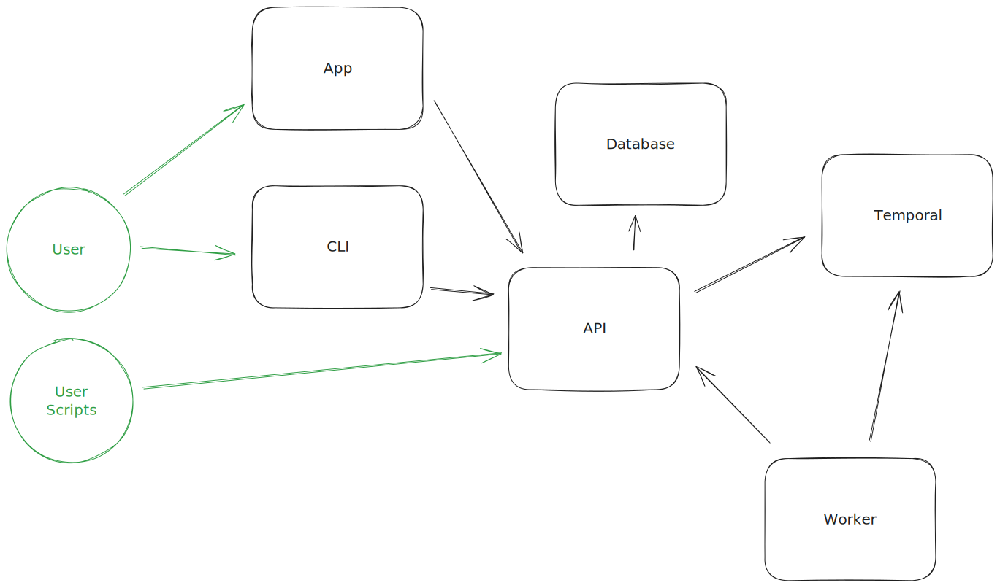

## Introduction

This page intends to shed light on what each component in the Neosync system is, as well as where it fits in the overall architecture.
This page will also detail the external dependencies that Neosync requires to run.

The four main components are:

1. Client-side app
2. Client-side Command-line Interface (CLI)
3. Server-side API
4. Server-side Workers

For more information on inputs that each component supports, see the [Environment Variables](../deploy/environment-variables.md) section of the deployment docs.

## Architecture Diagram

## Client-side App

This is the frontend of Neosync. Built using Nextjs.
This primarily interfaces with Neosync-Api and acts as a way to easily configure Neosync server settings and workflows.

## Client-side CLI

The CLI acts as a way to programmatically invoke operations in Neosync.
It's limited in functionality today, but currently gives the ability to do key operations such as triggering a workflow, and synchronizing a connection down to a locally hosted database.

This can be easily utilized within a Github Action to fill data from Neosync Connection to a locally hosted database.

See the CLI section of the docs for a more in-depth guide on the CLI.

## Server-side API

This is the primary API of Neosync and what most operations are routed through.
Written in Golang, it serves up a Connect, gRPC, and Web API generated via Protobuf.
It is backed by a Postgres Database, where it stores all of its configurations, save for explicit workflow data, which is deferred to Temporal.

## Server-side Worker

The worker process is a Golang based Temporal worker. Think of this in the event-driven world as a queue consumer.
When booted up, it listens on a queue specified within a Temporal namespace and will run actions when a workflow is available.

The worker uses mTLS to communicate securely with Temporal, and an API key to communicate with Neosync API.
This worker can run anywhere as long as it has appropriate access to do so (Neosync API, Temporal, and Neosync Connections), and can be scaled as needed.

Today the worker is built to handle every job that Neosync has available to it.

## Postgres Database

Neosync API uses a Postgres Database to persist all of its CRUD data.
Everything is stored within Postgres, except Temporal specific data, which is stored specifically within Temporal.

## Temporal

[Temporal](https://temporal.io/) is the primary workflow engine that Neosync uses to invoke all of the Neosync Jobs.
There are many benefits to Temporal, and we use it to give us reliability, reproducibility, and metadata around Neosync Jobs.

## Redis

Redis serves as an optional external dependency. It's specifically required if primary key transformations are to be utilized. This functionality allows for more advanced data synchronization capabilities by transforming primary keys during the synchronization process, and Redis facilitates this operation by providing the necessary data structure and caching capabilities​ in order to maintain data integrity.
